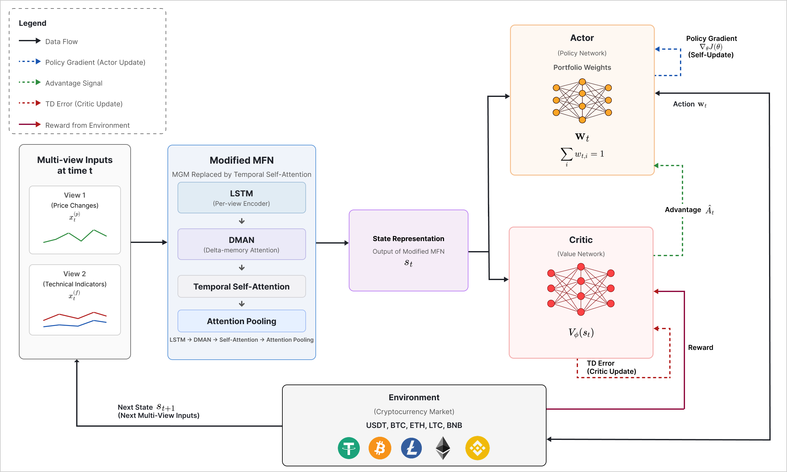

# DMTA-A2C Cryptocurrency Portfolio Optimization（4H）

本專案實作Dual-LSTM DMAN Temporal-Attention A2C（DMTA-A2C），目前統一使用
Binance 4小時K線，資產為BTC、ETH、LTC、BNB與USDT。
所有執行腳本直接放在`scripts/`，所有產物直接放在根目錄的`data/`、
`models/`、`results/`、`logs/`、`checkpoints/`與`figures/`，不再建立
`experiment1_4h`子資料夾。

## 共用實驗設定

- 資料期間：2018-01-01至2025-09-01。
- Test：最後1,080根4H資料，約180天。
- Train：Test以前的完整資料；不使用Validation。
- Train episode：隨機抽取180天。
- Window：`LOOKBACK=20`，即80小時；可在`scripts/config_4h.py`修改。
- 特徵：4維price-relative＋25維SMA20、EMA20、MACD、RSI14。
- Reward：由`scripts/config_4h.py`的`DSR_REWARD_SCALE`、`RETURN_REWARD_SCALE`與`DSR_ETA`統一管理。
- A2C：`n_steps=540`、epoch=1、normalize advantage、`log_std_init=-2`。
- DQN：5%離散權重網格、每項加密貨幣上限35%，共3,766種合法配置。
- 目標步數：由`scripts/config_4h.py`的`TOTAL_TIMESTEPS`統一管理。
- Test只用於最終評估，不參與Scaler或訓練。

## 資料準備

```powershell
python scripts\download_data_4h.py
python scripts\prepare_features_4h.py
```

## Experiment 1：技術指標與架構比較

比較DMTA-A2C、標準A2C、A2C without TI與Buy-and-Hold。A2C與A2C without TI
用來觀察技術指標的影響，DMTA-A2C與標準A2C則用來比較多模態特徵擷取與
直接特徵輸入的差異。

```powershell
python scripts\train_dman_temporal_attention_a2c.py
python scripts\train_a2c.py
python scripts\train_a2c_without_ti.py

python scripts\evaluate_dman_temporal_attention_a2c.py
python scripts\evaluate_a2c.py
python scripts\evaluate_a2c_without_ti.py
python scripts\evaluate_buy_and_hold.py
python scripts\compare_experiment1.py
```

輸出：

- `results/experiment_result/experiment1_4h_<steps>_comparison.csv`
- `results/experiment_result/experiment1_4h_<steps>_table.csv`
- `figures/experiment1/experiment1_4h_<steps>_portfolio_value.png`
- `figures/experiment1/experiment1_4h_<steps>_expanding_sharpe_ratio.png`

三種A2C方法皆可使用`--resume`，例如：

```powershell
python scripts\train_dman_temporal_attention_a2c.py --resume
```

## Experiment 2：強化學習方法比較

比較DMTA-A2C、標準A2C、離散動作DQN與Buy-and-Hold。DQN使用5%權重網格，
每項加密貨幣權重上限為35%，USDT不受相同上限限制，共3,766種合法配置。

```powershell
python scripts\train_dqn.py
python scripts\evaluate_dqn.py
python scripts\compare_experiment2.py
```

繪圖腳本會讀取同一`TOTAL_TIMESTEPS`標籤下的Temporal Attention、A2C與DQN結果，輸出：

- `results/experiment_result/experiment2_4h_<steps>_comparison.csv`
- `results/experiment_result/experiment2_4h_<steps>_table.csv`
- `figures/experiment2/experiment2_4h_<steps>_portfolio_value.png`
- `figures/experiment2/experiment2_4h_<steps>_differential_sharpe_ratio.png`
- `figures/experiment2/experiment2_4h_<steps>_expanding_sharpe_ratio.png`

## Experiment 3：Reward選擇

比較DMTA-A2C與標準A2C分別使用DSR reward及單期Portfolio Return reward的結果。
四個組合為DMTA-A2C（DSR）、DMTA-A2C（Return）、A2C（DSR）與
A2C（Return）。除了reward外，相同架構之間的4H資料、episode與訓練步數保持一致。

```powershell
python scripts\train_dman_temporal_attention_a2c.py
python scripts\train_proposed_return.py
python scripts\train_a2c.py
python scripts\train_a2c_return.py

python scripts\evaluate_dman_temporal_attention_a2c.py
python scripts\evaluate_proposed_return.py
python scripts\evaluate_a2c.py
python scripts\evaluate_a2c_return.py
python scripts\compare_experiment3.py
```

Return版本也支援`--resume`。輸出：

- `results/experiment_result/experiment3_4h_<steps>_comparison.csv`
- `results/experiment_result/experiment3_4h_<steps>_table.csv`
- `figures/experiment3/experiment3_4h_<steps>_portfolio_value.png`
- `figures/experiment3/experiment3_4h_<steps>_expanding_sharpe_ratio.png`

## Experiment 4：Original MFN-A2C架構比較

比較DMTA-A2C、Original MFN-A2C、標準A2C與Buy-and-Hold。Original MFN-A2C
保留MFN的雙LSTM、DMAN與MGM，用來比較以Temporal Self-Attention及Attention
Pooling取代MGM後的差異。

```powershell
python scripts\train_dman_temporal_attention_a2c.py
python scripts\train_original_mfn_a2c.py
python scripts\train_a2c.py

python scripts\evaluate_dman_temporal_attention_a2c.py
python scripts\evaluate_original_mfn_a2c.py
python scripts\evaluate_a2c.py
python scripts\evaluate_buy_and_hold.py
python scripts\compare_experiment4.py
```

輸出：

- `results/experiment_result/experiment4_4h_<steps>_comparison.csv`
- `results/experiment_result/experiment4_4h_<steps>_table.csv`
- `figures/experiment4/experiment4_4h_<steps>_portfolio_value.png`
- `figures/experiment4/experiment4_4h_<steps>_differential_sharpe_ratio.png`
- `figures/experiment4/experiment4_4h_<steps>_expanding_sharpe_ratio.png`

## 主要架構

本專案的多模態融合設計主要參考
[Memory Fusion Network（MFN）](https://github.com/pliang279/MFN)。目前架構保留
模態專屬LSTM與DMAN，並以Temporal Self-Attention及Attention Pooling取代
原始MFN的MGM，再將融合後的狀態表示輸入A2C進行投資組合配置。



- `src/dman_temporal_attention_extractor.py`實作目前提出的DMTA特徵擷取器。
- `src/original_mfn_extractor.py`實作Experiment 4使用的Original MFN特徵擷取器。
- DMAN在每個時間點融合價格與技術指標LSTM狀態。
- Temporal Self-Attention取代舊MGM/shared memory，建模LOOKBACK內跨時間關係。
- 一般A2C與A2C without TI仍使用Stable-Baselines3預設特徵流程。

## 注意事項

- 本機`original/`只保存舊版參考原碼，不參與目前4H流程，也不提交Git。
- 本機`tmp/`只存放暫存檔，不提交Git。
- 模型ZIP、checkpoint、logs與大型資料不應提交Git。
- 變更資料頻率、LOOKBACK、reward或特徵後，舊模型不可直接比較。
- 正式結果應使用多個random seed報告平均值與標準差。
- 目前未建模交易手續費與滑價。

模型、結果與checkpoint標籤會依`config_4h.py`主要參數動態生成。
